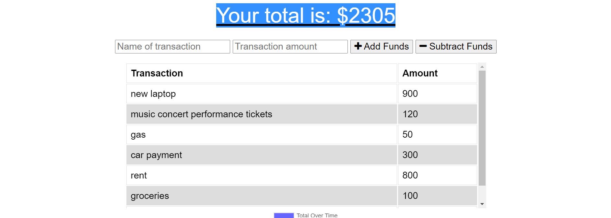
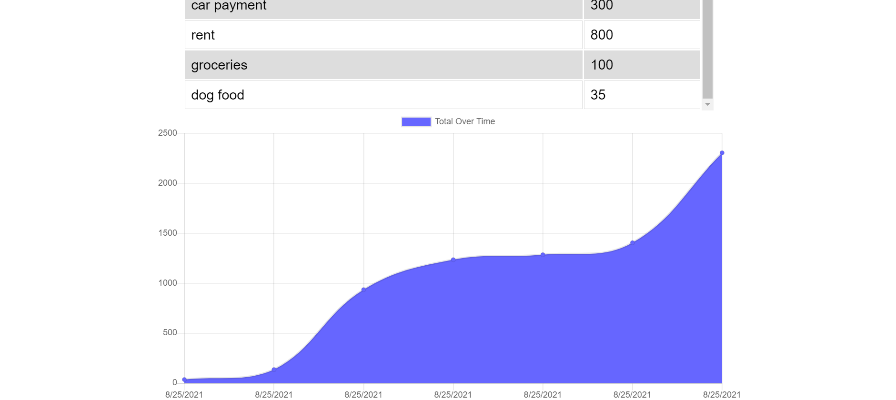

# BudgetTracker

# Description

For our week 19 assignment, we had to add functionality to our existing Budget Tracker application to allow for offline access and functionality.

Name: Progressive Budget Tracker

As a user, we want them to be able to track withdrawals and deposits with or without a data/internet connection
so that the users account balance is accurate.

The user will be able to add expenses and deposits to their budget with or without a connection. When entering transactions offline, they should populate the total when brought back online.

Offline Functionality:

- Enter deposits offline

- Enter expenses offline

When brought back online:

Offline entries should be added to tracker.

# Technologies Used

- HTML/CSS/Javascript
- Node.js
- Express.js
- MongoDB Atlas
- Heroku

# Links

Github URL: https://github.com/trevorwiegand92/BudgetTracker

Heroku URL: https://git.heroku.com/guarded-plains-62982.git

# Screenshots

### Here's a screenshot of the finished home page.

### Here's a screenshot of the application with data.

